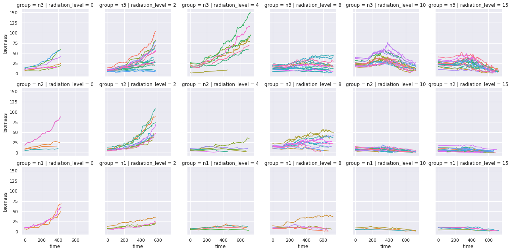
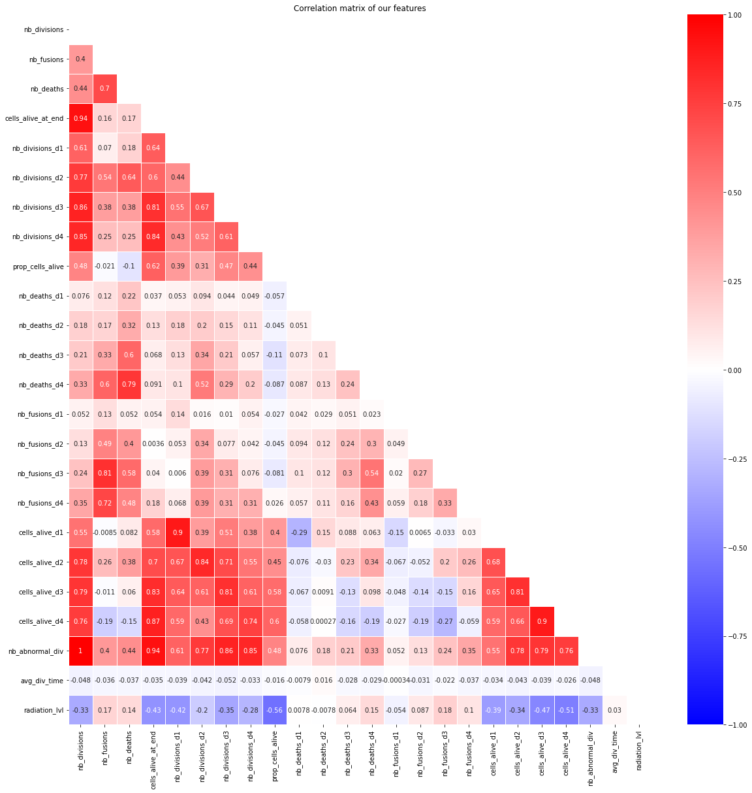
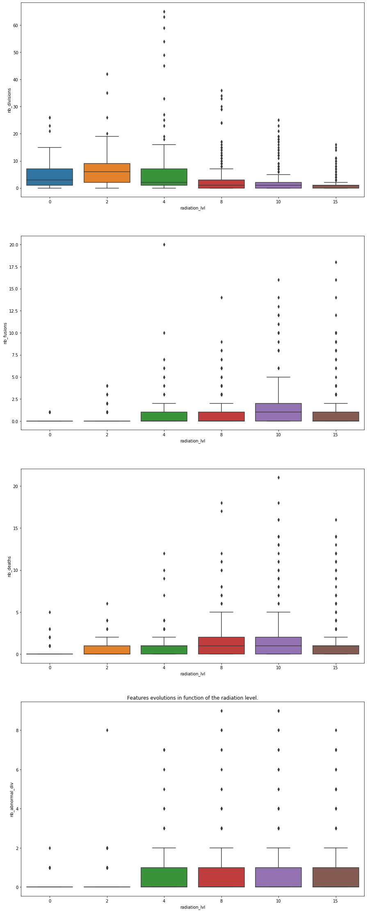
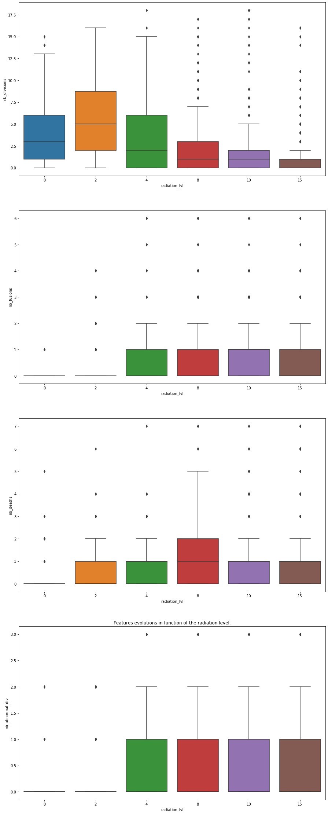

# ecn_radiobiology

This repository is used in the context of a project at École Centrale de Nantes in Computer Science major. The project deals with data science and data viz applied to radiobiology. This project is related to some research carried out at LS2N and INSERM in Nantes concerning gliobastoma.

Here are some of the graphics we obtained in this project :

## Time series

## Feature engineering and correlation

## Box plot

## Box plot without outliers

